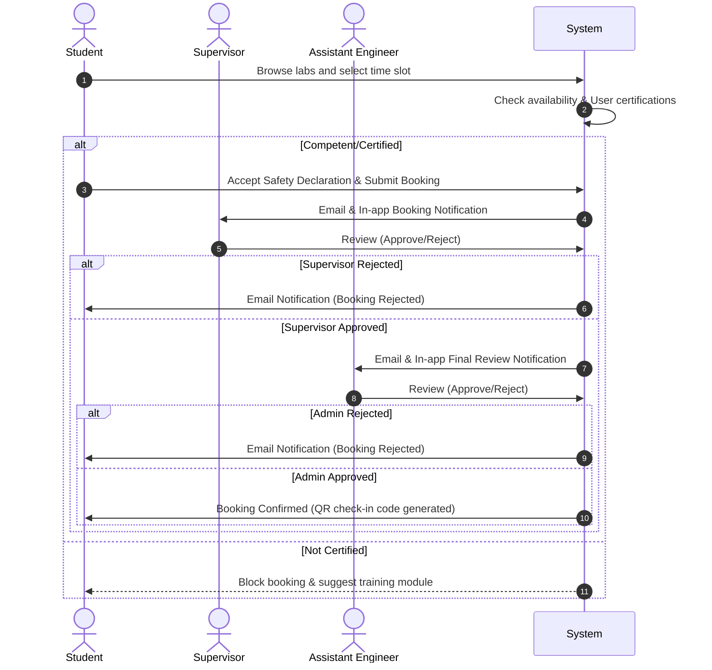

# Business Workflows Specification

This document details the core operational workflows of the **SPMP-FTKIP** system.

---

## 1. Laboratory & Equipment Booking Workflow

This multi-level approval ensures academic alignment, facility availability, and administrative check-off.



---

## 2. Damage Reporting & Work Order Workflow

This process ensures that equipment malfunctions are logged, technicians are assigned, and repairs are tracked for budget and operational planning.

```mermaid
graph TD
    A[Student/Lecturer discovers damage] --> B[Submit Damage Report with images]
    B --> C{Assistant Engineer reviews}
    C -->|Invalid/Not Damaged| D[Reject Report]
    C -->|Valid Damage| E[Update Equipment Status to 'Damaged']
    E --> F[Generate Maintenance Work Order]
    F --> G[Assign Technician & Set Expected Resolution Date]
    G --> H[Technician Repairs Equipment]
    H --> I[Update Work Order Details (Notes, Repair Cost)]
    I --> J[Mark Work Order 'Completed']
    J --> K[Update Equipment Status back to 'Available']
```

---

## 3. Laboratory QR Check-In / Check-Out Workflow

Enforces attendance logging and physical tracking of laboratory users.

1. **Step 1: Check-in Initiation**
   - User arrives at the laboratory door and opens the SPMP-FTKIP mobile/web dashboard.
   - User scans the physical QR code mounted on the door.
2. **Step 2: Validation**
   - The system checks if the user has an **Approved** booking for the current time slot.
   - If valid, the system records `check_in_time` in the `logbooks` table and updates user presence status.
3. **Step 3: Check-out**
   - Upon leaving, the user scans the door QR code again.
   - User writes a brief summary of the activity performed in the laboratory logbook form.
   - System records `check_out_time` and releases the workspace capacity metric.